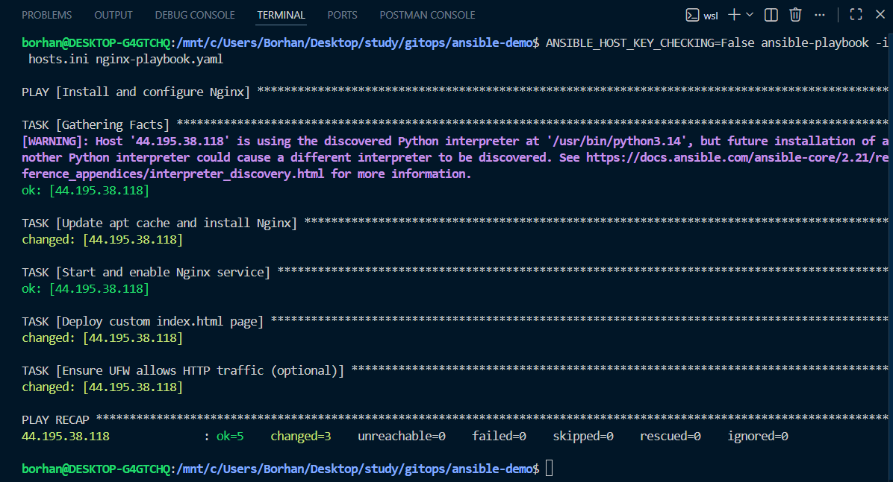

# Ansible Nginx Setup on Raw EC2

This project configures **Nginx** on a raw Ubuntu EC2 instance using **Ansible**.

## What this project does

- Connects to an EC2 host from Ansible inventory (`hosts.ini`)
- Installs Nginx
- Starts and enables the Nginx service
- Deploys a custom `index.html`
- Allows HTTP traffic in UFW (optional task)

## Project structure

- `hosts.ini` - Inventory with the EC2 host, SSH user, and key path
- `nginx-playbook.yaml` - Playbook to install and configure Nginx
- `results/` - Screenshots of command output and final browser result

## Prerequisites

- An Ubuntu EC2 instance reachable by SSH
- SSH private key that matches the EC2 key pair
- Ansible installed
- Collection for UFW task:

```bash
ansible-galaxy collection install community.general
```

## Important note for Windows users

If your host machine is Windows, you generally cannot run this kind of Linux-focused Ansible workflow natively in plain Windows shell the same way as Linux.
Use **WSL (Windows Subsystem for Linux)**, as done in this project, to run Ansible commands reliably.

## Inventory example

`hosts.ini`

```ini
[webservers]
44.195.38.118 ansible_user=ubuntu ansible_ssh_private_key_file=/home/borhan/.ssh/my-keyy.pem
```

## Run the playbook

```bash
ansible-playbook -i hosts.ini nginx-playbook.yaml
```

## Results

### Playbook execution output



### Final Nginx page on EC2


